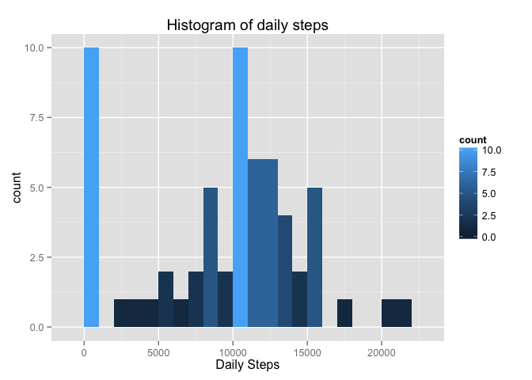
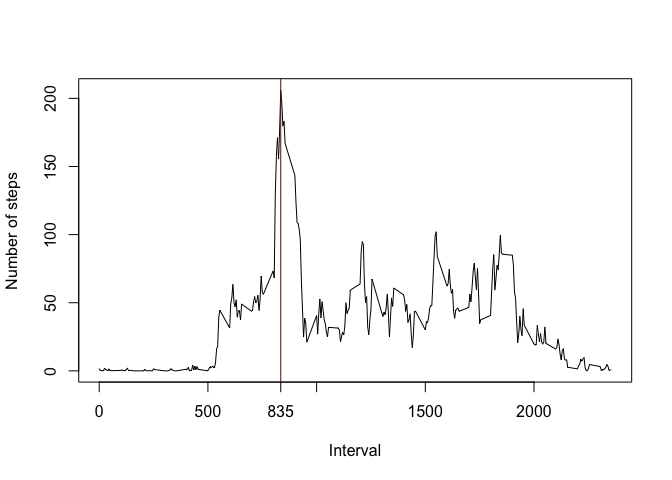
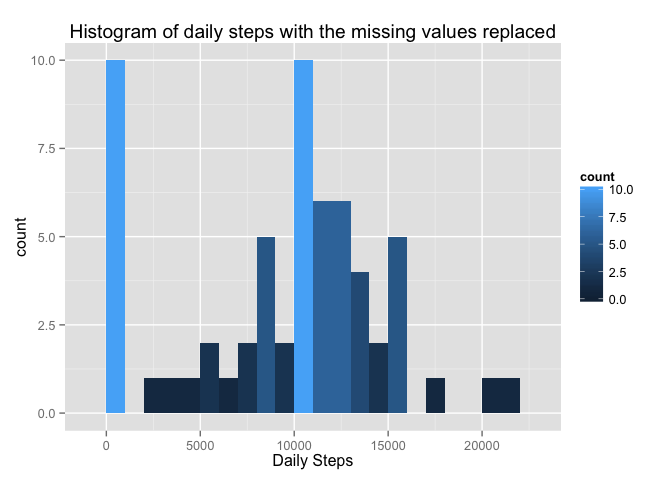
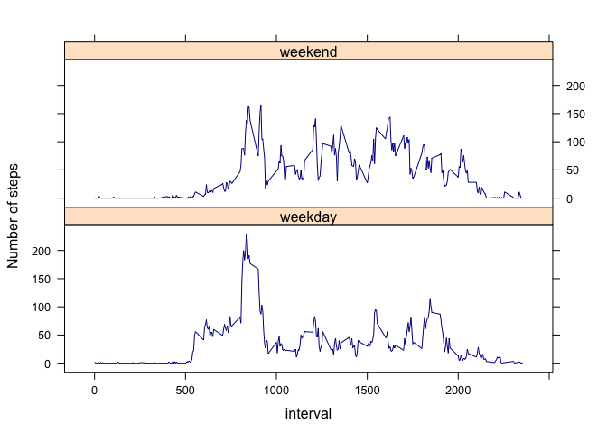

# Reproducible Research: Peer Assessment 1


## Loading and preprocessing the data

```r
library(ggplot2)
library(dplyr)
library(xtable)
library(knitr)
opts_chunk$set(fig.path = "figure/")
```
Load the data.

```r
activity <- read.csv("./data/activity.csv", header = TRUE, sep = ',', na.strings = 'NA')
```


## What is mean total number of steps taken per day?
The total number of steps taken each day during all days the data was collected is given in the table below.

```r
dailySteps <- summarize(group_by(activity, date), steps = sum(steps, na.rm = TRUE))
xt <- xtable(dailySteps)
print.xtable(xt,type = "html")
```

<!-- html table generated in R 3.1.1 by xtable 1.7-4 package -->
<!-- Mon Mar  9 17:43:15 2015 -->
<table border=1>
<tr> <th>  </th> <th> date </th> <th> steps </th>  </tr>
  <tr> <td align="right"> 1 </td> <td> 2012-10-01 </td> <td align="right">   0 </td> </tr>
  <tr> <td align="right"> 2 </td> <td> 2012-10-02 </td> <td align="right"> 126 </td> </tr>
  <tr> <td align="right"> 3 </td> <td> 2012-10-03 </td> <td align="right"> 11352 </td> </tr>
  <tr> <td align="right"> 4 </td> <td> 2012-10-04 </td> <td align="right"> 12116 </td> </tr>
  <tr> <td align="right"> 5 </td> <td> 2012-10-05 </td> <td align="right"> 13294 </td> </tr>
  <tr> <td align="right"> 6 </td> <td> 2012-10-06 </td> <td align="right"> 15420 </td> </tr>
  <tr> <td align="right"> 7 </td> <td> 2012-10-07 </td> <td align="right"> 11015 </td> </tr>
  <tr> <td align="right"> 8 </td> <td> 2012-10-08 </td> <td align="right">   0 </td> </tr>
  <tr> <td align="right"> 9 </td> <td> 2012-10-09 </td> <td align="right"> 12811 </td> </tr>
  <tr> <td align="right"> 10 </td> <td> 2012-10-10 </td> <td align="right"> 9900 </td> </tr>
  <tr> <td align="right"> 11 </td> <td> 2012-10-11 </td> <td align="right"> 10304 </td> </tr>
  <tr> <td align="right"> 12 </td> <td> 2012-10-12 </td> <td align="right"> 17382 </td> </tr>
  <tr> <td align="right"> 13 </td> <td> 2012-10-13 </td> <td align="right"> 12426 </td> </tr>
  <tr> <td align="right"> 14 </td> <td> 2012-10-14 </td> <td align="right"> 15098 </td> </tr>
  <tr> <td align="right"> 15 </td> <td> 2012-10-15 </td> <td align="right"> 10139 </td> </tr>
  <tr> <td align="right"> 16 </td> <td> 2012-10-16 </td> <td align="right"> 15084 </td> </tr>
  <tr> <td align="right"> 17 </td> <td> 2012-10-17 </td> <td align="right"> 13452 </td> </tr>
  <tr> <td align="right"> 18 </td> <td> 2012-10-18 </td> <td align="right"> 10056 </td> </tr>
  <tr> <td align="right"> 19 </td> <td> 2012-10-19 </td> <td align="right"> 11829 </td> </tr>
  <tr> <td align="right"> 20 </td> <td> 2012-10-20 </td> <td align="right"> 10395 </td> </tr>
  <tr> <td align="right"> 21 </td> <td> 2012-10-21 </td> <td align="right"> 8821 </td> </tr>
  <tr> <td align="right"> 22 </td> <td> 2012-10-22 </td> <td align="right"> 13460 </td> </tr>
  <tr> <td align="right"> 23 </td> <td> 2012-10-23 </td> <td align="right"> 8918 </td> </tr>
  <tr> <td align="right"> 24 </td> <td> 2012-10-24 </td> <td align="right"> 8355 </td> </tr>
  <tr> <td align="right"> 25 </td> <td> 2012-10-25 </td> <td align="right"> 2492 </td> </tr>
  <tr> <td align="right"> 26 </td> <td> 2012-10-26 </td> <td align="right"> 6778 </td> </tr>
  <tr> <td align="right"> 27 </td> <td> 2012-10-27 </td> <td align="right"> 10119 </td> </tr>
  <tr> <td align="right"> 28 </td> <td> 2012-10-28 </td> <td align="right"> 11458 </td> </tr>
  <tr> <td align="right"> 29 </td> <td> 2012-10-29 </td> <td align="right"> 5018 </td> </tr>
  <tr> <td align="right"> 30 </td> <td> 2012-10-30 </td> <td align="right"> 9819 </td> </tr>
  <tr> <td align="right"> 31 </td> <td> 2012-10-31 </td> <td align="right"> 15414 </td> </tr>
  <tr> <td align="right"> 32 </td> <td> 2012-11-01 </td> <td align="right">   0 </td> </tr>
  <tr> <td align="right"> 33 </td> <td> 2012-11-02 </td> <td align="right"> 10600 </td> </tr>
  <tr> <td align="right"> 34 </td> <td> 2012-11-03 </td> <td align="right"> 10571 </td> </tr>
  <tr> <td align="right"> 35 </td> <td> 2012-11-04 </td> <td align="right">   0 </td> </tr>
  <tr> <td align="right"> 36 </td> <td> 2012-11-05 </td> <td align="right"> 10439 </td> </tr>
  <tr> <td align="right"> 37 </td> <td> 2012-11-06 </td> <td align="right"> 8334 </td> </tr>
  <tr> <td align="right"> 38 </td> <td> 2012-11-07 </td> <td align="right"> 12883 </td> </tr>
  <tr> <td align="right"> 39 </td> <td> 2012-11-08 </td> <td align="right"> 3219 </td> </tr>
  <tr> <td align="right"> 40 </td> <td> 2012-11-09 </td> <td align="right">   0 </td> </tr>
  <tr> <td align="right"> 41 </td> <td> 2012-11-10 </td> <td align="right">   0 </td> </tr>
  <tr> <td align="right"> 42 </td> <td> 2012-11-11 </td> <td align="right"> 12608 </td> </tr>
  <tr> <td align="right"> 43 </td> <td> 2012-11-12 </td> <td align="right"> 10765 </td> </tr>
  <tr> <td align="right"> 44 </td> <td> 2012-11-13 </td> <td align="right"> 7336 </td> </tr>
  <tr> <td align="right"> 45 </td> <td> 2012-11-14 </td> <td align="right">   0 </td> </tr>
  <tr> <td align="right"> 46 </td> <td> 2012-11-15 </td> <td align="right">  41 </td> </tr>
  <tr> <td align="right"> 47 </td> <td> 2012-11-16 </td> <td align="right"> 5441 </td> </tr>
  <tr> <td align="right"> 48 </td> <td> 2012-11-17 </td> <td align="right"> 14339 </td> </tr>
  <tr> <td align="right"> 49 </td> <td> 2012-11-18 </td> <td align="right"> 15110 </td> </tr>
  <tr> <td align="right"> 50 </td> <td> 2012-11-19 </td> <td align="right"> 8841 </td> </tr>
  <tr> <td align="right"> 51 </td> <td> 2012-11-20 </td> <td align="right"> 4472 </td> </tr>
  <tr> <td align="right"> 52 </td> <td> 2012-11-21 </td> <td align="right"> 12787 </td> </tr>
  <tr> <td align="right"> 53 </td> <td> 2012-11-22 </td> <td align="right"> 20427 </td> </tr>
  <tr> <td align="right"> 54 </td> <td> 2012-11-23 </td> <td align="right"> 21194 </td> </tr>
  <tr> <td align="right"> 55 </td> <td> 2012-11-24 </td> <td align="right"> 14478 </td> </tr>
  <tr> <td align="right"> 56 </td> <td> 2012-11-25 </td> <td align="right"> 11834 </td> </tr>
  <tr> <td align="right"> 57 </td> <td> 2012-11-26 </td> <td align="right"> 11162 </td> </tr>
  <tr> <td align="right"> 58 </td> <td> 2012-11-27 </td> <td align="right"> 13646 </td> </tr>
  <tr> <td align="right"> 59 </td> <td> 2012-11-28 </td> <td align="right"> 10183 </td> </tr>
  <tr> <td align="right"> 60 </td> <td> 2012-11-29 </td> <td align="right"> 7047 </td> </tr>
  <tr> <td align="right"> 61 </td> <td> 2012-11-30 </td> <td align="right">   0 </td> </tr>
   </table>
The plot below shows the histogram of the total number of steps taken each day:  

```r
ggplot(dailySteps, aes(x=steps)) +
        geom_histogram(binwidth = 1000, aes(fill=..count..)) +
        ggtitle("Histogram of daily steps") +
        xlab("Daily Steps")
```

 
  
Calculate the mean and median of the total number of steps taken per day.

```r
meanDailySteps <- as.integer(round(mean(dailySteps$steps)))
medianDailySteps <- as.integer(round(median(dailySteps$steps)))
```
The mean total number of steps taken per day is 9354.  
The median total number of steps taken per day is 10395.


## What is the average daily activity pattern?
Calculate  and plot the average number of steps taken per 5-minute intervals averaged across all days.

```r
dailyPattern <- summarize(group_by(activity, interval), steps = mean(steps, na.rm = TRUE))
maxInterval <- dailyPattern[which.max(dailyPattern$steps),][[1]]
plot(dailyPattern$interval, dailyPattern$steps, type = 'l', xaxt = 'n',
     xlab = "Interval", ylab = "Number of steps")
axis(1, at = c(0,500,maxInterval, 1000, 1500, 2000))
abline(v=maxInterval, col = "dark red")
```

 
The 835 5-minute interval contains the maximum number of steps on average across all the days in the dataset.

## Imputing missing values

```r
intervalsWithoutStep <- length(which(is.na(activity$steps)))
```
The dataset contains 2304 intervals with missing values.

The missing values are replaced with the average number of steps taken per 5-minute intervals averaged across all days.

```r
intervalSteps <- summarize(group_by(activity, interval), intervalSteps = floor(mean(steps, na.rm = TRUE)))
activityNoNa <- mutate(activity, steps = ifelse(is.na(steps), intervalSteps$intervalSteps, steps))
```
The histogram of the total number of steps taken each day is plotted again, but this time with the missing values replaced.

```r
dailyStepsNoNa <- summarize(group_by(activityNoNa, date), steps = sum(steps))
ggplot(dailySteps, aes(x=steps)) +
        geom_histogram(binwidth = 1000, aes(fill=..count..)) +
        ggtitle("Histogram of daily steps with the missing values replaced") +
        xlab("Daily Steps")
```

 
Calculate the mean and median of the total number of steps taken per day with the missing values replaced.

```r
meanDailyStepsNoNa <- as.integer(round(mean(dailyStepsNoNa$steps)))
medianDailyStepsNoNa <- as.integer(round(median(dailyStepsNoNa$steps)))
```
The mean total number of steps taken per day is 10750 with the missing values replaced.  
The median total number of steps taken per day is 10641 with the missing values replaced.

Thus, the mean total number of steps taken per day with the missing values replaced is increased with 1396 steps. By the same token, the median is increased with 246 steps.

## Are there differences in activity patterns between weekdays and weekends?
Create a new factor variable with two levels – “weekday” and “weekend” indicating whether a given date is a weekday or weekend day in the dataset with the filled-in missing values.

```r
Sys.setlocale("LC_TIME","C") #Get weekdays in English in RStudio
activityNoNa <- mutate(activityNoNa, day.of.week = as.factor(ifelse((weekdays(as.Date(activity$date))) %in% c("Saturday", "Sunday"), "weekend", "weekday")))
```
Make a panel plot containing a time series plot of the 5-minute interval and the average number of steps taken, averaged across all weekday days or weekend days.

```r
library(lattice)
intervalStepsWeek <- summarize(group_by(activityNoNa, interval, day.of.week), intervalSteps = floor(mean(steps)))
xyplot(intervalSteps ~ interval | day.of.week, data=intervalStepsWeek, type = "l", col ="dark blue", ylab = "Number of steps", layout = c(1,2))
```

 

